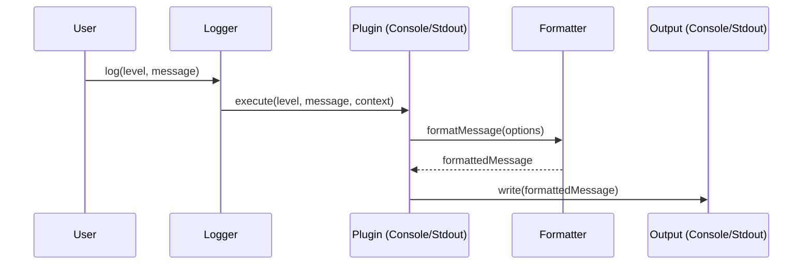

# Hyperse Logger

A powerful, pluggable, and flexible type-safe logger for modern applications. Built with TypeScript and designed for extensibility through a plugin system, Hyperse Logger provides a robust foundation for application logging with enterprise-grade features.

## 🚀 Why Hyperse Logger?

Modern applications require sophisticated logging capabilities that go beyond simple console output. Hyperse Logger addresses these needs with a design philosophy centered around **type safety**, **extensibility**, and **performance**.

### Core Philosophy

- **Type Safety First**: Full TypeScript support with advanced type inference ensures your logging code is as reliable as your application code
- **Plugin-Driven Architecture**: Extend functionality through a flexible plugin system without modifying core behavior
- **Performance Optimized**: Lightweight core with efficient message processing through Hyperse Pipeline
- **Developer Experience**: Intuitive API design that feels natural and productive

## ✨ Key Features

### 🔌 Pluggable Architecture

Extend functionality through a flexible plugin system. Each plugin can handle different aspects of logging - from output formatting to external service integration. The core logger remains lightweight while plugins provide specialized functionality.

### 🛡️ Type Safety

Built with TypeScript from the ground up, providing compile-time guarantees for your logging operations. Context-aware logging with full type inference ensures you never lose track of your application state.

### ⚡ High Performance

Lightweight core with efficient message processing through Hyperse Pipeline. Minimal overhead ensures logging doesn't impact your application's performance.

### 🎯 Multiple Log Levels

Comprehensive log level support including Error, Warn, Info, Debug, and Verbose levels. Each level is designed for specific use cases and can be filtered independently.

### 🔄 Pipeline Support

Built-in pipeline for message transformation and processing. Chain multiple operations to format, filter, or enhance your log messages before output.

### 🎨 Flexible Messages

Support for both string and structured message objects. Context-aware logging allows you to include relevant application state in your log messages.

### 🔧 Context-Aware

Rich context system with type-safe plugin integration. Share application state across your logging pipeline while maintaining type safety.

### 🚀 Modern ES Modules

Native ES module support for modern JavaScript environments. Compatible with Node.js, browsers, and bundlers.

### 📦 Zero Dependencies

Minimal core with optional plugin ecosystem. Only includes essential functionality, keeping your bundle size small.

## 🏗️ Architecture Overview

### Core Components

**Logger Builder**: A fluent API for configuring and building logger instances with plugins and context.

**Plugin System**: Extensible architecture that allows plugins to handle different aspects of logging - from output formatting to external service integration.

**Pipeline Engine**: Built on Hyperse Pipeline for efficient message processing and transformation.

**Context Management**: Type-safe context system that allows sharing application state across the logging pipeline.

### Plugin Ecosystem

Hyperse Logger comes with a growing ecosystem of official plugins:

- **[Console Plugin](/docs/console)**: Rich console output with colors, timestamps, and formatting
- **[Stdout Plugin](/docs/stdout)**: Standard output plugin optimized for server environments

### Message Flow

1. **Log Call**: Application calls logger method with message and optional context
2. **Level Filtering**: Messages are filtered based on configured threshold level
3. **Plugin Processing**: Each plugin processes the message through its execute function
4. **Pipeline Transformation**: Messages can be transformed through the pipeline system
5. **Output**: Final formatted message is output through configured plugins

## 🎯 Use Cases

### Web Applications

Perfect for modern web applications requiring structured logging with context awareness. Track user actions, API requests, and application state with full type safety.

### Microservices

Ideal for microservice architectures where consistent logging across services is crucial. Plugin system allows for service-specific logging requirements.

### Server-Side Applications

Robust logging for Node.js applications with support for multiple output formats and external service integration.

### Development Tools

Extensible logging for development tools and CLI applications with rich console output and debugging capabilities.
